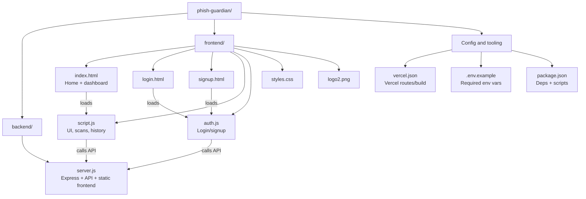

# 🛡️ Phish Guardian

A powerful cybersecurity web application that protects users from phishing attacks by analyzing suspicious URLs and emails using real threat intelligence from VirusTotal.

## ✨ Features

- **🔗 URL Analysis** - Scan suspicious websites for threats
- **📧 Email Protection** - Detect phishing emails and extract malicious URLs
- **🔐 User Authentication** - Secure signup, login, and user management
- **📊 Scan History** - Track all your security analyses
- **🎨 Modern UI** - Beautiful, responsive design inspired by Tesla
- **📱 Mobile Responsive** - Works perfectly on all devices

## 🚀 Live Demo

Visit: [Your Vercel URL will go here]

## 🛠️ Technology Stack

- **Backend**: Node.js, Express.js
- **Frontend**: HTML5, CSS3, Vanilla JavaScript
- **Authentication**: Session-based with bcryptjs
- **Security**: VirusTotal API integration
- **Deployment**: Vercel

## 📁 Project Structure

```
phish-guardian/
├── backend/
│   └── server.js          # Express server & API endpoints
├── frontend/
│   ├── index.html         # Home page
│   ├── login.html         # Login page
│   ├── signup.html        # Registration page
│   ├── styles.css         # All styling
│   ├── script.js          # Main application logic
│   ├── auth.js            # Authentication handling
│   └── logo2.png          # Custom logo
├── vercel.json            # Vercel deployment config
├── package.json           # Dependencies
└── README.md              # This file
```

### Wireframe (overview)



## 🚀 Getting Started

### Prerequisites
- Node.js (v14 or higher)
- npm or yarn
- VirusTotal API key

### Installation

1. **Clone the repository**
   ```bash
   git clone [your-repo-url]
   cd phish-guardian
   ```

2. **Install dependencies**
   ```bash
   npm install
   ```

3. **Set up environment variables**
   Copy the example environment file and fill in your values:
   ```bash
   cp .env.example .env
   ```
   
   Then edit `.env` with your actual values:
   ```env
   PORT=8080
   NODE_ENV=development
   FRONTEND_URL=http://localhost:8080
   JWT_SECRET=your-secret-key-change-in-production
   VIRUSTOTAL_API_KEY=your_virustotal_api_key_here
   ```
   
   **Important**: 
   - `JWT_SECRET` and `VIRUSTOTAL_API_KEY` are **required** - the server will not start without them
   - Generate a strong `JWT_SECRET` with: `node -e "console.log(require('crypto').randomBytes(32).toString('hex'))"`
   - Get your VirusTotal API key from: https://www.virustotal.com/gui/join-us

4. **Run the development server**
   ```bash
   npm run dev
   ```

5. **Open your browser**
   Navigate to `http://localhost:8080`

## 🔧 API Endpoints

- `POST /api/auth/register` - User registration
- `POST /api/auth/login` - User authentication
- `POST /api/auth/logout` - User logout
- `GET /api/auth/me` - Get current user info
- `POST /api/analyze/url` - Analyze suspicious URLs
- `POST /api/analyze/email` - Analyze email content
- `GET /api/user/scans` - Get user's scan history

## 🎨 Design Features

- **Color Scheme**: White, Light Steel (#495057), Tranquil Earth (#839788)
- **Typography**: Inter font family for modern readability
- **Animations**: Smooth transitions and hover effects
- **Responsive**: Mobile-first design approach
- **Accessibility**: Proper contrast and keyboard navigation

## 🔒 Security Features

- Password hashing with bcryptjs
- Session-based authentication with secure cookies
- Protected API routes with authentication middleware
- Input validation and sanitization
- CORS protection (configurable for production)
- Helmet.js security headers (XSS protection, content security policy)
- Environment variable validation (required secrets)
- No hardcoded API keys or secrets

## 📱 Responsive Design

- **Desktop**: Two-column layout for analysis sections
- **Tablet**: Adaptive grid system
- **Mobile**: Stacked layout with hamburger menu

## 🚀 Deployment

This project is configured for deployment on Vercel:

1. **Push to GitHub**
2. **Connect to Vercel**
3. **Set environment variables**
4. **Deploy automatically**

## 🤝 Contributing

1. Fork the repository
2. Create a feature branch
3. Commit your changes
4. Push to the branch
5. Open a Pull Request

## 📄 License

© 2025 Qhelani Moyo. All rights reserved.

## 📞 Contact

- **Email**: qhestoemoyo@gmail.com
- **Project**: [GitHub Repository URL]

## 🙏 Acknowledgments

- **VirusTotal** for threat intelligence API
- **Express.js** team for the web framework
- **Open source community** for various tools and libraries

---

**Built with ❤️ by Qhelani Moyo**
